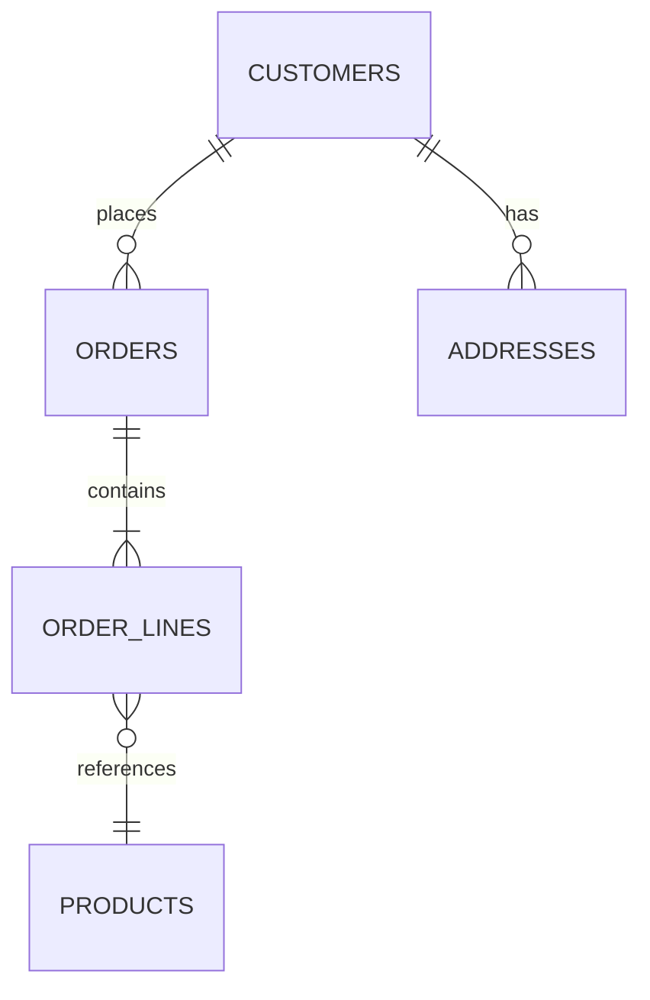
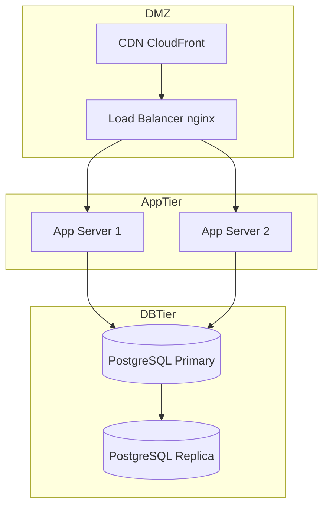

# Legacy System Design & Visualization

## Role
**Senior Master Architect** — Reconstruct and visually document the legacy architecture with precision. Produce diagrams that make even the most chaotic legacy systems understandable.

## Instructions

1. Read the - `legacy_architecture.html` and `legacy_architecture.md` files after created to ensure they are correctly generated and contain the required diagrams and documentation. If the HTML file is not rendering diagrams correctly, check for common Mermaid syntax issues (unclosed blocks, reserved keywords in node IDs, etc.) and regenerate the file if needed.
2. **Run validation** on the generated HTML file using the File Creation Validation Checklist from [STANDARDS.md](./STANDARDS.md) before proceeding. This ensures the diagrams will render correctly and are not broken due to syntax errors or file generation issues.
3. **Report validation results**:
   - If valid: Confirm the diagram is valid and exit
   - If invalid: Show the errors found and explain what's wrong
4. **Fix the issues** automatically (invalid diagrams have no value)
5. **Re-validate** to confirm the fix worked
6. Repeat steps 4-5 until there are no validation issues

## When to Use
- After completing legacy analysis (`legacy-analysis` skill)
- Need visual blueprints of the legacy system for team alignment
- Prior to designing the new target architecture

## Prerequisites (Preflight)
Before starting, verify the following artifact exists:

| Artifact | Expected Path | Required? |
|---|---|---|
| Legacy analysis report | `ai-driven-development/docs/legacy_analysis/legacy_analysis.md` | Always |

**If the required artifact is missing**: Stop. Report: "Artifact `ai-driven-development/docs/legacy_analysis/legacy_analysis.md` not found. This is produced by Phase 1 (`legacy-analysis`). Options: (a) Run Phase 1 now, (b) Provide the path to the artifact manually."

## Output Location
Create folder `ai-driven-development/docs/legacy_architecture/` and produce:
- `legacy_architecture.md` — Architecture documentation
- `legacy_architecture.html` — Interactive visual diagrams (Mermaid.js)

> ⚠️ **Always overwrite these files completely** — never append. Use the active runtime's file-writing mechanism to write the full content from scratch. Appending produces two HTML documents in one file, which breaks rendering.

---

## Procedure

### Step 1 — Identify Architectural Style
Determine the dominant architectural pattern:
- **Monolith**: Single deployable unit, shared DB
- **Layered (N-Tier)**: Presentation → Business → Data
- **Modular Monolith**: Internal modules with clear boundaries
- **SOA**: Service-oriented, WSDL/SOAP contracts
- **Legacy Distributed**: Multiple apps, shared DB (common anti-pattern)

Document the style formally and explain why it was likely chosen historically.

### Step 2 — Module Boundary Mapping
- List all modules/components/subsystems
- Identify responsibilities and ownership
- Mark which modules are **coupled**, **cohesive**, or **isolated**
- Identify **shared kernel** — code that is consumed by multiple modules
- Identify **cross-cutting concerns**: logging, auth, error handling

### Step 3 — Communication Pattern Analysis
Map how components communicate:
- **Synchronous**: HTTP, RPC, direct DB calls
- **Asynchronous**: JMS, MQ, file-based messaging
- **Database coupling**: Multiple services writing to same tables
- **Event-driven**: Any pub/sub or callback patterns

#### External Dependency Criticality Matrix

For every external integration identified (third-party APIs, SaaS, on-prem services, partner feeds), populate the following matrix. This feeds Phase 3 resilience and fallback decisions.

| Dependency | Protocol | Direction | RTO Impact | Replacement Cost | SPoF? | Notes |
|---|---|---|---|---|---|---|
| _e.g. Payment Gateway_ | _HTTPS REST_ | _outbound_ | _High — blocks checkout_ | _High (bespoke contract)_ | _Yes_ | _No circuit-breaker today_ |
| _e.g. SMTP Relay_ | _SMTP_ | _outbound_ | _Low — async email_ | _Low (commodity)_ | _No_ | _Could switch to SES_ |

**Column definitions:**
- **RTO Impact** — `High` (system unusable without it) / `Medium` (degraded) / `Low` (cosmetic / async)
- **Replacement Cost** — `High` (bespoke integration, data-lock-in) / `Medium` / `Low` (commodity/substitutable)
- **SPoF?** — `Yes` if no fallback exists and failure propagates to users

Flag any dependency with both `RTO Impact = High` **and** `SPoF? = Yes` as a **critical integration risk** — these become mandatory inputs to Phase 3 target architecture resilience patterns (circuit breaker, bulkhead, async fallback).

### Step 4 — Generate Visual Diagrams (HTML + Mermaid.js)
Produce all diagrams as an HTML file with embedded Mermaid.js.

Use the **HTML + Mermaid.js Page Template** from [STANDARDS.md](./STANDARDS.md) as the starting document for `legacy_architecture.html`.

Required diagram sections (match the template structure):
- **4.1** — High-Level Architecture (system boundary: clients, app server, DB, external)
- **4.2** — Component Dependency Diagram (all modules, coupling visible)
- **4.3** — Data Flow Diagram (request → processing → response)
- **4.4** — Authentication/Authorization Flow (login sequence)
- **4.5** — Database Architecture (ER overview, ownership, God-table highlights) — *skip if NoSQL-only*
- **4.6** — Deployment Topology (servers, network zones, load balancers, environments)

> **Important**: Replace ALL placeholder node labels with the ACTUAL legacy system components discovered during analysis. The template is a starting point only.

#### Diagram 4.5 — Database Architecture
Produce an entity-relationship overview (not a full-column ER — key entities and relationships only):

- Include all major tables/collections grouped by owning module (use Mermaid `subgraph` or `erDiagram`)
- Highlight **God tables** (shared by 3+ modules) with a distinct style or annotation
- Show **cross-module DB coupling** edges (dashed arrows between subgraphs)
- Mark tables with > 1M rows as high-volume (use a note or label)
- For NoSQL stores: show collection groupings and their primary access patterns instead of ER notation



#### Diagram 4.6 — Deployment Topology
Map the runtime infrastructure as a Mermaid `graph TD` (or `C4Context` style):

- **Compute**: All servers, VMs, containers, Lambda functions with their roles
- **Load balancers & reverse proxies**: nginx, HAProxy, AWS ALB, Cloudflare, etc.
- **CDN**: If present — origin and edge cache points
- **Network zones**: DMZ, internal app tier, DB tier, admin zone (use `subgraph` per zone)
- **Environment inventory**: List all environments (prod, staging, UAT, dev) and whether they are isolated or shared
- **External service endpoints**: DNS, NTP, SMTP relay, VPN gateways



### Step 4.1 — Validate the Generated HTML File

After writing `legacy_architecture.html`, run through the **File Creation Validation Checklist** from [STANDARDS.md](./STANDARDS.md) before proceeding.

Key checks for this skill's output:
- `<!DOCTYPE html>` appears exactly **once** (no accidental file append)
- All 6 required diagrams are present as `<pre class="mermaid">` blocks (not `<div>`)
- Every `subgraph` block is closed with `end`
- `alt … else … end` in sequenceDiagram is fully closed
- No `\n` inside quoted node labels — use `<br/>` for multi-line labels
- Node IDs contain no spaces or reserved keywords (`end`, `subgraph`)

If the file is missing or any check fails, **regenerate the entire file** from scratch using the active runtime's file-writing mechanism. Do not attempt to patch individual lines.

### Step 5 — Identify Architectural Weaknesses
Document at least 3 critical weaknesses:

| # | Weakness | Evidence | Impact | Migration Risk |
|---|---|---|---|---|
| 1 | Shared database between modules | Multiple modules write to `USERS` table | High coupling | High |
| 2 | Business logic in stored procedures | 40+ stored procs with complex logic | Hard to test/migrate | High |
| 3 | Hard-coded configuration | DB URLs in source code | Security risk | Medium |

### Step 6 — Coupling Hotspot Map
Identify the tightest coupling points that will be hardest to untangle during migration:
- Shared DB tables with multiple consumers
- God classes/services with 20+ dependencies
- Circular module dependencies
- Framework-specific annotations bleeding into domain logic

---

## Output Format

### legacy_architecture.md
```markdown
# Legacy System Architecture

## 1. Architectural Style
## 2. Module Inventory
  - 2.1 Module List with Responsibilities
  - 2.2 Module Dependency Matrix
## 3. Communication Patterns
  - 3.1 Synchronous Calls
  - 3.2 Asynchronous Flows
  - 3.3 Database Coupling Points
## 4. Cross-Cutting Concerns
## 5. Architectural Weaknesses
## 6. Coupling Hotspots
## 7. Constraints for New Design
```

### legacy_architecture.html
Full Mermaid.js HTML file containing all diagrams from Step 4 above, customized to actual system components.

---

## Definition of Done (DoD)

> 📋 **Quality review**: Before marking this phase complete, consult [quality-playbook/SKILL.md](../quality-playbook/SKILL.md) §3 — Phase 2 quality gates.

### Diagrams
- [ ] High-level architecture diagram (system boundary clearly shown)
- [ ] Component dependency diagram (all modules included, coupling visible)
- [ ] Data flow diagram (input → processing → output for main flows)
- [ ] Authentication/authorization flow diagram
- [ ] Database architecture diagram (entity groupings, God tables, cross-module coupling)
- [ ] Deployment topology diagram (network zones, servers, LB, CDN, environments)
- [ ] All diagrams rendered correctly in HTML (verify in browser)

### Technical Accuracy
- [ ] All integrations mapped with protocol (HTTP, JMS, DB direct, FTP, etc.)
- [ ] Sync vs async flows clearly distinguished
- [ ] Stateful vs stateless components identified
- [ ] Shared data stores identified with all consumers listed

### Insights
- [ ] At least 3 architectural weaknesses identified with evidence
- [ ] Tight coupling areas highlighted with migration risk rating
- [ ] Coupling hotspot map produced

### Validation
- [ ] Diagram walkthrough completed with system design team
- [ ] Diagrams reviewed for accuracy against design decisions
- [ ] Mermaid syntax validated and diagrams render without errors in browser

---

## Next Skill
When legacy architecture is fully visualized, proceed to [`target-architecture`](../target-architecture/SKILL.md) to design the target architecture.
